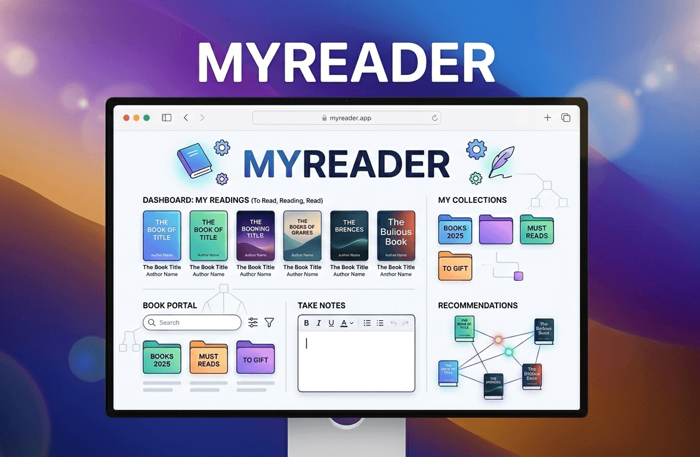

# 📘 MyReader

<p align="center">
  
</p>

<p align="center">
  
  
  
  
</p>

---

## 🚀 About the Project

**MyReader** is a reading planning and tracking system that allows users to explore books, organize collections, write notes, and receive recommendations.

This project is built as part of a **Data Structures course**, focusing on applying theoretical concepts in a real-world application.

---

## ✨ Features

- 🔐 User authentication (Firebase Auth)
- 📚 Book catalog browsing
- 🔎 Search and filtering
- 🗂️ Custom collections
- 🧠 Recommendation system
- 📝 Notes per book
- 📊 Personal reading dashboard

## 🛠️ Tech Stack

| Layer    | Technology           |
| -------- | -------------------- |
| Frontend | React + TypeScript   |
| Backend  | Firebase             |
| Database | Firestore            |
| Auth     | Firebase Auth        |
| Styling  | Tailwind CSS, Shadcn |

## ⚙️ Installation

1. Clone the repo

```
git clone https://github.com/eddiedev14/myreader.git
cd myreader
```

2. Install dependencies

```
npm install
```

3. Configure your environment variables: Check the file .env.template and based on it create your own .env file with your firebase database

4. Run the project

```
npm run dev
```

## Project Goals

- Apply data structures in real scenarios
- Build a scalable frontend with Firebase
- Implement clean architecture
- Deliver a functional academic project

## Authors

<p align="left">
   
   
</p>

## License

Academic use only.
