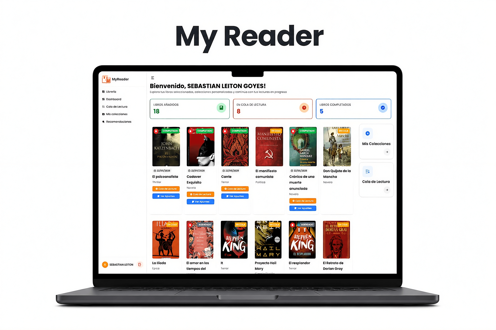

<p align="center">
  
</p>

<h1 align="center">📚 MyReader</h1>

<p align="center">
  <em>Tu experiencia de lectura, centralizada y personalizada.</em>
</p>

<p align="center">
  
  
  
  
  
</p>

---

# 🌐 Live Demo

🚀 Prueba MyReader ahora:
https://myreader-app.vercel.app

---

## 📖 Descripción General

**MyReader** es una aplicación web diseñada para que los usuarios gestionen y planifiquen su experiencia de lectura personal de forma centralizada. Más que un simple listado de libros, MyReader combina organización, planificación, anotaciones y recomendaciones inteligentes en una sola plataforma.

Este proyecto nació como aplicación académica universitaria, con el propósito de demostrar el uso de **estructuras de datos clásicas en un contexto real** (búsqueda con Tries, paginación con listas, sistema de comentarios con árboles N-arios, cola de lectura con Queues y recomendaciones con Grafos), todo integrado sobre un stack moderno con Firebase como backend.

---

## 🎯 Propósito del Sistema

MyReader nace para resolver una necesidad concreta de los lectores que consiste la fragmentación de su vida lectora. Hoy, un lector gestiona sus libros pendientes en una nota de celular, sus reseñas en otra app, sus recomendaciones en conversaciones de WhatsApp y su progreso en su memoria. No existe un espacio único, personal y organizado para todo eso.

El propósito de MyReader es ser ese espacio: una plataforma web centralizada donde el usuario pueda **explorar libros, planificar sus lecturas, registrar sus avances, escribir sus reflexiones y descubrir nuevos títulos**, todo en un mismo lugar y de forma personalizada.

---

## 🔭 Alcance del Sistema

MyReader cubre el ciclo completo de la experiencia de lectura de un usuario, desde el descubrimiento hasta el registro de lo leído:

**Incluido en el sistema:**

- Autenticación completa de usuarios (registro, inicio y cierre de sesión) mediante Firebase Authentication.
- Portal público de libros con búsqueda por título e ISBN (Trie), filtrado por género/subgénero y paginación (Lista).
- Publicación de libros en el sistema con todos sus metadatos (ISBN, autores, géneros, sinopsis, portada).
- Dashboard personal por usuario con visualización de estadísticas y estado de cada libro.
- Cola de lectura con gestión de estados progresivos: `AGENDADO → EN COLA → EN LECTURA → LEÍDO` (Queue).
- Sistema de colecciones manuales para agrupar libros por criterio personal.
- Notas por libro mediante un editor de texto enriquecido (Tiptap), disponible durante y después de la lectura.
- Sistema de comentarios y respuestas anidadas en tiempo real por libro (N-Ary Tree + Firebase Realtime Database).
- Motor de recomendaciones automáticas basadas en autores y géneros de los libros del usuario (Grafo).
- Sincronización en tiempo real de todos los datos del usuario con Firestore (`onSnapshot`).

**Fuera del alcance actual:**

- Aplicación móvil nativa (el sistema es exclusivamente web).
- Integración con APIs externas de libros (Google Books, Open Library, etc.).
- Sistema de calificaciones o ratings por libro.
- Funcionalidades sociales entre usuarios (seguir a otros lectores, compartir colecciones).
- Notificaciones push o por correo electrónico.
- Panel de administración para la moderación de contenido.

## ✨ Funcionalidades Principales

| Módulo                 | Descripción                                                                         |
| ---------------------- | ----------------------------------------------------------------------------------- |
| **Autenticación**      | Registro, inicio y cierre de sesión con Firebase Auth                               |
| **Portal de Libros**   | Catálogo público con búsqueda, filtrado y paginación                                |
| **Dashboard Personal** | Vista personal con estadísticas y libros agregados                                  |
| **Cola de Lectura**    | Gestión ordenada del progreso de lectura (EN COLA → EN LECTURA → LEÍDO)             |
| **Colecciones**        | Agrupaciones manuales de libros según criterios del usuario                         |
| **Comentarios**        | Sistema de comentarios y respuestas en tiempo real por libro                        |
| **Notas por Libro**    | Editor de texto enriquecido con Tiptap para anotaciones personales                  |
| **Recomendaciones**    | Sugerencias automáticas basadas en autores y géneros según los libros del Dashboard |

---

## 🛠️ Stack Tecnológico

| Capa                             | Tecnología                   |
| -------------------------------- | ---------------------------- |
| **Frontend**                     | React 19 + TypeScript        |
| **Build Tool**                   | Vite 8                       |
| **Estilos**                      | Tailwind CSS 4 + shadcn/ui   |
| **Routing**                      | React Router DOM v7          |
| **Backend / Auth**               | Firebase Authentication      |
| **Base de Datos Principal**      | Cloud Firestore (NoSQL)      |
| **Base de Datos en Tiempo Real** | Firebase Realtime Database   |
| **Almacenamiento**               | Firebase Storage             |
| **Editor de Notas**              | Tiptap                       |
| **Alertas / Feedback**           | SweetAlert2 + React Toastify |
| **Iconos**                       | Remix Icons                  |

---

## 🏗️ Arquitectura y Tiempo Real

MyReader utiliza **dos bases de datos de Firebase** de manera complementaria, cada una elegida por sus características específicas:

### Cloud Firestore — Base de datos principal

Toda la lógica de negocio principal (libros, usuarios, colecciones, dashboard, notas) se persiste en **Firestore** y se sincroniza en tiempo real usando el método `onSnapshot`, que abre un listener activo sobre cada colección o documento.

Esto garantiza que cualquier cambio en la base de datos (por parte de cualquier usuario) se refleje **instantáneamente** en todos los clientes conectados, sin necesidad de hacer polling ni refrescar la página.

### Firebase Realtime Database — Comentarios en tiempo real

Los **comentarios de los libros** utilizan exclusivamente **Realtime Database**, sincronizados mediante el listener `onValue`. Esta decisión es intencional: el sistema de comentarios requiere latencia mínima y actualizaciones muy frecuentes. Realtime Database está optimizado para este patrón de datos ligero y de alta frecuencia, a diferencia de Firestore que cuesta más por operación de lectura.

---

## 🧩 Estructuras de Datos

Una parte central del proyecto es la implementación de estructuras de datos teóricas aplicadas a problemas reales. Cada estructura fue elegida por su idoneidad para el problema que resuelve.

---

### 1. 📄 Listas (Double Linked List) — Paginación del Portal

El portal de libros utiliza una **lista** para mantener el orden de aparición de los resultados y gestionar la paginación. Los libros recuperados de Firestore se dividen en páginas de tamaño fijo (`PAGE_SIZE`). Esto permite al usuario navegar hacia adelante o atrás por el catálogo, y saltar directamente a una página específica.

**¿Por qué esta estructura?** Las listas preservan el orden de inserción y permiten recorrer, mostrar y actualizar elementos de forma eficiente. La paginación sobre una lista ordenada es O(1) para acceso por índice de página.

---

### 2. 🔤 Trie — Búsqueda de Libros

La búsqueda del portal usa un **Trie** construido en memoria con todos los libros disponibles. Cada libro se indexa tanto por título como por ISBN. Al escribir en el buscador, se realiza una búsqueda por prefijo que recorre el árbol de caracteres y recolecta todos los libros cuyo título o ISBN coincida con el texto introducido. Adicionalmente, el autocompletado muestra un máximo de **5 sugerencias** en tiempo real mientras el usuario escribe.

**¿Por qué esta estructura?** La búsqueda por prefijo en un Trie es O(m) donde m es la longitud del prefijo, independientemente del número total de libros. Esto la hace significativamente más eficiente que un filtro lineal para catálogos grandes.

---

### 3. 🌳 Árbol N-ario (N-Ary Tree) — Sistema de Comentarios

Los comentarios de cada libro se estructuran como un **árbol N-ario**, donde cada comentario raíz puede tener múltiples respuestas, y cada respuesta puede tener a su vez sus propias respuestas (anidamiento jerárquico). El árbol se construye dinámicamente desde el array plano recibido de Realtime Database.

**¿Por qué esta estructura?** Un árbol N-ario representa de forma natural las relaciones padre-hijo de los hilos de comentarios. Permite renderizar la jerarquía de forma recursiva y gestionar operaciones como "eliminar comentario con todas sus respuestas" de manera limpia y eficiente.

---

### 4. 🚶 Cola (Queue) — Cola de Lectura

La funcionalidad de cola de lectura implementa una **Queue adaptada** que gestiona el orden en que el usuario planea leer sus libros. La implementación sigue el espíritu FIFO (el siguiente libro a leer es el primero de la cola), pero con una adaptación importante: permite eliminar elementos en cualquier posición, similar a cómo funciona la cola de reproducción en Spotify.

Los estados posibles de un libro en la cola son: `AGENDADO` → `EN COLA` → `EN LECTURA` → `LEÍDO`. La lógica garantiza que no se puede avanzar al siguiente libro sin completar el anterior.

> **Nota de diseño:** No se sigue un FIFO estricto porque obligar al usuario a esperar hasta llegar a un libro para eliminarlo generaría una mala experiencia. La cola refleja la _intención_ de lectura, no una restricción rígida.

**¿Por qué esta estructura?** La Queue garantiza que el usuario mantiene un orden de lectura claro y progresivo, mientras que la operación `removeAt` le da la flexibilidad necesaria para reorganizar sus planes sin fricciones.

---

### 5. 🕸️ Grafo (Graph) — Sistema de Recomendaciones

El motor de recomendaciones construye un **grafo no dirigido** donde cada libro es un nodo. Las aristas se establecen automáticamente entre libros que comparten autor o género principal. Al visitar la sección de recomendaciones, el sistema recorre las adyacencias de los libros del dashboard del usuario para sugerir títulos aún no añadidos.

**¿Por qué esta estructura?** Un grafo modela de forma natural las relaciones entre libros. Traversar las adyacencias de los libros leídos por el usuario es una operación directa que no requiere recorrer todo el catálogo, haciendo las recomendaciones eficientes y personalizadas.

---

## 📂 Estructura del Proyecto

```
src/
├── features/
│   ├── auth/                  # Autenticación (registro, login, logout)
│   ├── books/
│   │   ├── algorithms/
│   │   │   ├── tree/          # CommentNode (N-Ary Tree)
│   │   │   └── tries/         # Node + Trie (búsqueda)
│   │   ├── components/        # BookCard, CommentList, BookSearch...
│   │   ├── hooks/             # useBookSearch, useComments...
│   │   └── utils/             # buildCommentTree
│   ├── collections/           # Colecciones personalizadas
│   ├── dashboard/             # Dashboard personal + estadísticas
│   ├── notes/                 # Editor de notas por libro (Tiptap)
│   ├── readingQueue/
│   │   ├── algorithms/        # Queue (cola de lectura)
│   │   └── hooks/             # useReadingQueueState
│   └── recommendations/
│       ├── algorithms/        # Graph (recomendaciones)
│       └── hooks/             # useRecommendations
├── firebase/
│   ├── config.ts              # Inicialización de Firebase
│   ├── hooks/
│   │   ├── useCollection.ts   # Firestore + onSnapshot
│   │   └── useRTCollection.ts # Realtime DB + onValue
├── pages/                     # Library, Dashboard, Recommendations...
├── router/                    # PrivateRoute, GuestOnlyRoute
└── shared/                    # Elementos reutilizables (Double Linked List)
```

---

## ⚙️ Instalación y Configuración

### Prerrequisitos

- Node.js >= 18
- Una cuenta en [Firebase](https://firebase.google.com/) con un proyecto configurado

### Pasos

**1. Clonar el repositorio**

```bash
git clone https://github.com/eddiedev14/myreader.git
cd myreader
```

**2. Instalar dependencias**

```bash
npm install
```

**3. Configurar variables de entorno**

Copia el archivo de plantilla y complétalo con las credenciales de tu proyecto Firebase:

```bash
cp .env.template .env
```

El archivo `.env.template` contiene todas las variables necesarias. Puedes obtener los valores desde la consola de Firebase en **Configuración del proyecto → Tus apps**.

**4. Ejecutar en desarrollo**

```bash
npm run dev
```

**5. Compilar para producción**

```bash
npm run build
```

---

## 🗃️ Modelo de Datos (Firebase)

| Colección / Nodo       | Almacenamiento        | Descripción                                      |
| ---------------------- | --------------------- | ------------------------------------------------ |
| `users`                | Firestore             | Perfil del usuario                               |
| `books`                | Firestore             | Catálogo global de libros                        |
| `users/{userId}/books` | Firestore             | Libros del usuario con estado y posición en cola |
| `collections`          | Firestore             | Colecciones personalizadas del usuario           |
| `comments/{bookId}`    | **Realtime Database** | Comentarios y respuestas en tiempo real          |

---

## 👤 Historias de Usuario Implementadas

| ID     | Historia                              | Estructura de Datos            | Desarrollador  |
| ------ | ------------------------------------- | ------------------------------ | -------------- |
| HU-001 | Registrar usuario                     | —                              | Eddie          |
| HU-002 | Iniciar sesión                        | —                              | Eddie          |
| HU-003 | Cerrar sesión                         | —                              | Eddie          |
| HU-004 | Publicar libros en el sistema         | —                              | Leiton         |
| HU-005 | Visualizar listado de libros          | **Lista (Double Linked List)** | Leiton         |
| HU-006 | Buscar y filtrar libros               | **Trie**                       | Leiton         |
| HU-007 | Ver información detallada de un libro | —                              | Eddie          |
| HU-008 | Comentarios en libros                 | **N-Ary Tree + Realtime DB**   | Eddie          |
| HU-009 | Dashboard personal                    | —                              | Eddie          |
| HU-010 | Cola de lectura                       | **Queue**                      | Eddie          |
| HU-011 | Colecciones personalizadas            | —                              | Leiton         |
| HU-012 | Libros en colecciones                 | —                              | Leiton         |
| HU-013 | Guardar nota general por libro        | —                              | Leiton         |
| HU-014 | Recibir recomendaciones de libros     | **Grafo**                      | Eddie y Leiton |

---

## 🎯 Objetivos del Proyecto

- Demostrar la aplicación práctica de estructuras de datos clásicas en un producto real.
- Construir una arquitectura frontend escalable sobre Firebase.
- Implementar sincronización en tiempo real con Firestore y Realtime Database.
- Entregar una experiencia de usuario intuitiva y fluida.

---

## 👥 Autores

<p align="left">
  <a href="https://github.com/eddiedev14">
    
  </a>
  &nbsp;
  <a href="https://github.com/leiton05">
    
  </a>
</p>

---

## 📄 Licencia

Este proyecto es de uso académico universitario. Todos los derechos reservados a sus autores.
